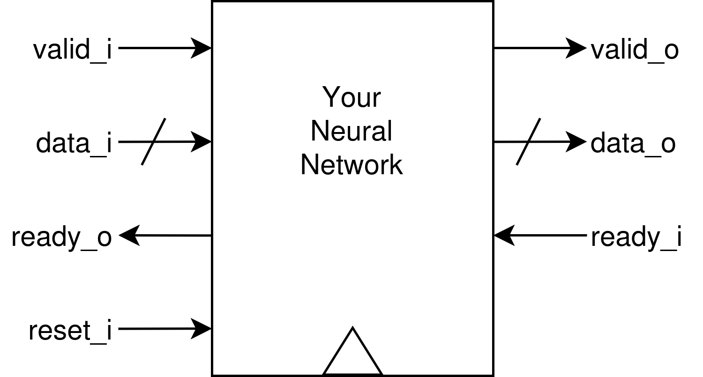

# Neural Network in Verilog

*This document is a work in progress, feel free to suggest additions, format changes, grammar corrections, and whatever else I missed*

## Purpose
The purpose of this project is to gain more familiarity with neural network architecture and inference, while understanding how different neural network operations can be implemented at the RTL (register transfer level i.e. Verilog) abstraction level. I would also recommend that you learn how to use the tools in simple cases. Depending on the complexity of your project you may want to write custom Makefiles. Knowing how to run the commandline tools will be helpful (not just for this project).

## Implementation
The dataset that you choose will inform your implementation architecture. I recommend that you choose a seemingly easier dataset,  and extend with new features as time allows rather than tackling a complex dataset from the start.

No need to be ultra concerned with dataflow and memory. For this project you are probably going to be doing a lot of hardcoding. As long as it simulates, it's fine, later on if we attempt an FPGA implementation we will worry about hardware limitations, dataflow, etc.

### Interface
We're going to be using AXI stream for both the consumer and producer interface because it's easy to understand and implement. The shape of the input and output data will be determined by the dataset you choose to work with.

## Reports
This project will include a small report. YAY! You should be keeping track of things as they come up. Nothing much but not nothing.

### Design
When you've decided what dataset you want to design for, create a design outline with the structure of your neural network. Explain why you made your design decisions and why your architecture is suited to the dataset.

### Obstacles
This is mostly for me to see the friction points of this project for future quarters. But it's useful to both the you and others in the future to see what problems you faced and how you solved them. Don't hesitate to keep it short, inaccurate fluff is just as bad as vagueness.

### Results
Did your model work? What could make it better? Define performance metrics and explain how well your model performs.

## Datasets
We are only going to make test-benches for a limited amount of datasets. If you have a dataset you really want to use that isn't listed, don't hesitate to ask and we can figure out if it's reasonable. Keep in mind that the input sizes should be relatively small. One thing you should be thinking about is if you want to work on data that is static, like an image, or time varying, like a video. Both bring different challenges and will inform your architecture.

### MNIST
For this dataset the input will be a 28x28 static image of bright and dark pixels, so data\_i will be a 784 bit wide bus (left to right, top to bottom). The output will be a binary number from 1-10, this is not necessarily the output of the neural network, your implementation should handle output decoding.

### ST-MNIST (Rate Encoded)
For this dataset the input will be a 28x28 video of bright and dark pixels, so data\_i will be a 784 bit wide bus (left to right, top to bottom). Whether or not the pixels are bright or dark is a probability that is dependent on the brightness of the pixel in the original dataset of static images. The frames will step through time according to the AXIS interface. The output will be a binary number from 1-10, this is not necessarily the output of the neural network, your implementation should handle output decoding. If you are planning to use this dataset, you should use an architecture designed to handle time-varying inputs.

## Extending the project
    - Parametrization
    - FPGA Implementation
    - Power/Energy Estimations
    - Area Estimations
    - On-Hardware Training

